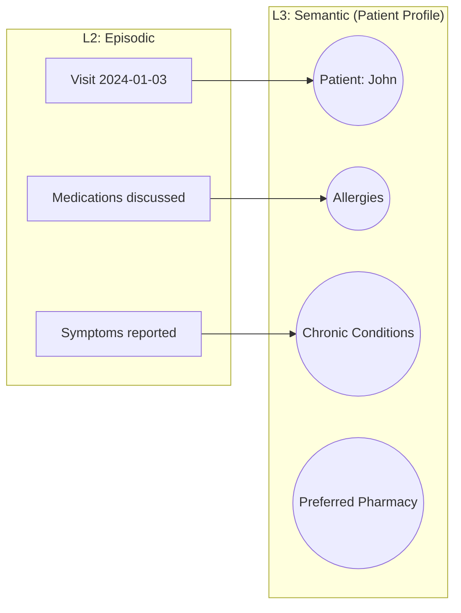
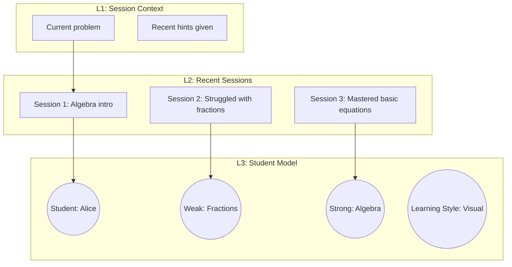
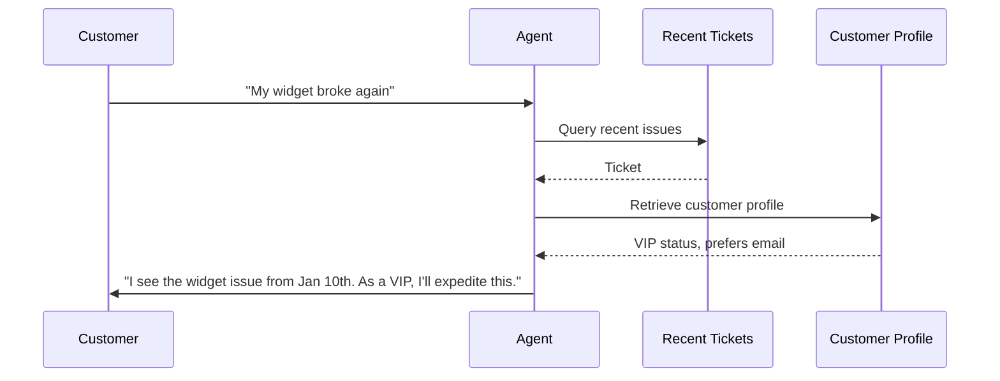
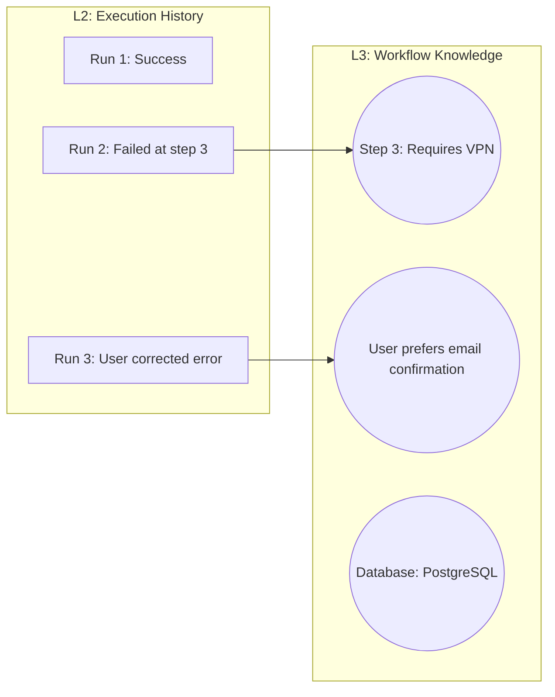
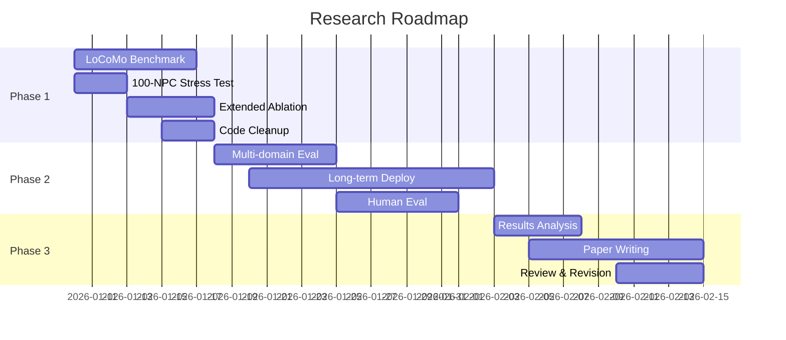

# CSAM: Broader Applications & Research Roadmap

This document extends the research paper with:
1. Applications beyond games
2. Industry implementation patterns
3. Additional experiments for conclusive results
4. Compute requirements and timeline

---

## Part 1: Broader Applications

### 1.1 Healthcare: Patient History Management

**Problem:** Healthcare AI must remember patient context across visits without exceeding privacy-safe storage limits.

**CSAM Application:**



**Value Proposition:**
- **Memory bounding**: HIPAA-compliant by limiting raw data retention
- **Consolidation**: Important conditions persist; routine visit details can be forgotten
- **Retrieval**: O(log N) lookup for relevant history regardless of visit count

**Metrics to Report:**
- Medication recall accuracy after N visits
- Time to retrieve relevant allergies
- Storage reduction vs full history retention

---

### 1.2 Education: Adaptive Tutoring Systems

**Problem:** Tutoring AI needs long-term memory of student progress, knowledge gaps, and learning preferences while adapting to real-time performance.

**CSAM Application:**



**Value Proposition:**
- **Personalization**: Remember individual learning styles and gaps
- **Forgetting**: Forget detailed problem attempts; retain skill mastery status
- **Scalability**: Single system handles thousands of students

**Metrics to Report:**
- Knowledge retention across sessions
- Personalized recommendation accuracy
- Student model consistency over time

---

### 1.3 Customer Service: Relationship Continuity

**Problem:** Support agents must recognize returning customers and maintain context across tickets without unbounded CRM bloat.

**CSAM Application:**



**Value Proposition:**
- **Context retention**: Remember preferences and history across interactions
- **Efficient storage**: Expire detailed transcripts; retain key insights
- **Personalization**: VIP detection, preferred communication channels

**Metrics to Report:**
- First-call resolution rate improvement
- Customer satisfaction (CSAT) correlation with memory usage
- Storage efficiency vs full transcript retention

---

### 1.4 Enterprise: Workflow Automation

**Problem:** AI workers executing multi-step workflows must maintain state, learn from past executions, and avoid repeating mistakes.

**CSAM Application:**



**Value Proposition:**
- **Learning from failures**: Consolidate error patterns into actionable knowledge
- **User preferences**: Remember individual user customizations
- **Bounded state**: Forget old execution details; retain learned insights

**Metrics to Report:**
- Error rate reduction over time
- Workflow completion time improvement
- Knowledge node accumulation rate

---

## Part 2: Additional Experiments for Conclusive Results

### 2.1 Experiment Matrix

| Experiment | Goal | Compute Needed | Duration |
|------------|------|----------------|----------|
| **E1: LoCoMo Direct** | Direct F1 comparison | 1 GPU, 24h | 1 week |
| **E2: 100-NPC Stress** | Scalability proof | 1 GPU, 8h | 2 days |
| **E3: Ablation Extended** | Strategy comparison | 1 GPU, 48h | 1 week |
| **E4: Long-term Deployment** | Real-world validation | Continuous | 2 weeks |
| **E5: Human Evaluation** | Believability study | 20 participants | 1 week |
| **E6: Multi-domain** | Generalization proof | 1 GPU, 24h | 1 week |

---

### 2.2 E1: Direct LoCoMo Benchmark

**Objective:** Run on the official LoCoMo dataset for direct F1 comparison with H-MEM and baselines.

**Implementation:**
```python
# Download LoCoMo dataset
# https://github.com/snap-stanford/locomo

# Adapt CSAM to LoCoMo format:
# - Load persona-grounded dialogues
# - Populate L2 with conversation turns
# - Run consolidation periodically
# - Evaluate on official QA splits
```

**Metrics:**
- F1 score per category (single-hop, multi-hop, temporal, adversarial)
- BLEU-1 for response generation
- Latency per query

**Expected Outcome:**
- F1 ≥ 50 (competitive with RAG baselines)
- F1 improvement: +10-15 over base RAG

---

### 2.3 E2: 100-NPC Stress Test

**Objective:** Prove that CSAM scales to production game requirements.

**Configuration:**
- 100 NPCs with unique personalities
- 10,000 memories per NPC
- 1,000 concurrent queries

**Metrics:**
- P99 retrieval latency
- Memory footprint per NPC
- Recall accuracy at scale

**Expected Outcome:**
- P99 < 50ms (O(log N) maintained)
- Memory < 50MB per NPC
- Recall ≥ 70%

---

### 2.4 E3: Extended Ablation Study

**Objective:** Deeper comparison of forgetting strategies with statistical significance.

**Configurations:**

| Strategy | Variants |
|----------|----------|
| No Forgetting | - |
| LRU | Thresholds: 100, 200, 500 |
| Importance | Thresholds: 0.3, 0.5, 0.7 |
| CSAM | α/β/γ/δ weight sweep |

**Metrics per configuration:**
- Recall accuracy (mean ± std over 10 runs)
- Memory growth curve
- Important fact preservation rate

**Expected Outcome:**
- CSAM ≥ LRU + 5% on important fact preservation
- CSAM = No Forgetting on overall recall
- Statistical significance: p < 0.05

---

### 2.5 E4: Long-term Deployment Study

**Objective:** Validate CSAM in realistic usage patterns over extended time.

**Setup:**
1. Deploy 5 NPCs with web interface
2. Recruit users for 2-week interaction sessions
3. Track memory evolution and recall quality

**Metrics:**
- Recall accuracy over time (daily measurements)
- Consolidation ratio evolution
- User-perceived coherence (surveys)

**Expected Outcome:**
- Recall maintains >70% over 2 weeks
- Consolidation reaches 95%+
- User satisfaction increases with memory depth

---

### 2.6 E5: Human Evaluation Study

**Objective:** Measure perceived believability of memory-augmented NPCs.

**Protocol:**
1. 20 participants
2. Each interacts with 2 NPCs: CSAM vs. no-memory baseline
3. 10-turn conversations, then recall test
4. Likert-scale ratings on believability, coherence, personalization

**Metrics:**
- Believability score (1-5)
- Preference rate (CSAM vs baseline)
- Qualitative feedback

**Expected Outcome:**
- CSAM preferred >70% of time
- Believability score ≥ 4.0/5.0

---

### 2.7 E6: Multi-Domain Generalization

**Objective:** Prove CSAM works beyond fantasy game NPCs.

**Domains:**

| Domain | Test Scenario |
|--------|---------------|
| Healthcare | Simulated patient intake memory |
| Education | Tutoring session continuity |
| Customer Service | Support ticket context |
| Personal Assistant | Calendar and preference recall |

**Metrics per domain:**
- Domain-specific recall accuracy
- Response coherence
- Scalability characteristics

**Expected Outcome:**
- Recall ≥ 75% across all domains
- No domain-specific degradation

---

## Part 3: Compute Requirements

### 3.1 Current Hardware (User's Setup)

| Component | Spec |
|-----------|------|
| GPU | RTX 4060 8GB |
| RAM | 16GB DDR5 |
| CPU | Intel i7-13HX |
| LLM | Llama 3.2 3B (local) |

**Capability:**
- 5-10 NPCs comfortably
- Single-run evaluations
- Development and small-scale testing

### 3.2 Cloud Compute Recommendations

| Experiment | Recommended | Cost Estimate | Provider |
|------------|-------------|---------------|----------|
| E1: LoCoMo | 1x A100 40GB | $15-20 (24h) | Lambda/RunPod |
| E2: 100-NPC | 1x A100 40GB | $10-15 (8h) | Lambda/RunPod |
| E3: Ablation | 1x A100 40GB | $30-40 (48h) | Lambda/RunPod |
| E4: Long-term | CPU instance | $20-30 (2 weeks) | DigitalOcean |
| E5: Human Eval | User hardware | - | - |
| E6: Multi-domain | 1x A100 40GB | $15-20 (24h) | Lambda/RunPod |

**Total Estimated Cloud Cost: $100-150**

### 3.3 Free/Low-Cost Alternatives

| Resource | Capability |
|----------|------------|
| Google Colab Pro ($10/mo) | T4/A100 for short runs |
| Kaggle Notebooks | Free GPU quota |
| University HPC | If available via institution |
| Ollama (local) | All experiments possible but slower |

---

## Part 4: Research Standards & Submission Targets

### 4.1 Target Conferences

| Conference | Deadline | Focus | Fit |
|------------|----------|-------|-----|
| **AAMAS 2026** | Nov 2025 | Autonomous agents | High |
| **AAAI 2026** | Aug 2025 | General AI | Medium |
| **NeurIPS Agents Workshop** | Sep 2025 | LLM agents | High |
| **AIIDE 2026** | May 2026 | Games + AI | High |
| **ACL 2026** | Jan 2026 | NLP/Dialog | Low |
| **EMNLP 2026** | May 2026 | NLP/Dialog | Low |

### 4.2 Required Evaluation Standards

Based on web research, top conferences expect:

1. **Established Benchmarks:**
   - LoCoMo (primary for long-term conversation)
   - BEAM (episodic memory)
   - LTM Benchmark (NeurIPS 2024)

2. **Metrics:**
   - F1 Partial Match (for QA)
   - BLEU-1/ROUGE (for generation)
   - Latency measurements
   - Memory efficiency

3. **Baselines:**
   - RAG (vanilla)
   - MemGPT
   - H-MEM (if possible)
   - Ablation (our strategies)

4. **Reproducibility:**
   - Open-source code
   - Configuration files
   - Clear instructions

5. **Statistical Rigor:**
   - Multiple runs (N≥5)
   - Standard deviation reporting
   - Significance tests (p-values)

---

## Part 5: Research Roadmap

### 5.1 Phase 1: Strengthen Current Results (1-2 weeks)

| Task | Priority |
|------|----------|
| Run LoCoMo benchmark | HIGH |
| 100-NPC stress test | HIGH |
| Extended ablation with significance | MEDIUM |
| Code cleanup and documentation | HIGH |

### 5.2 Phase 2: New Experiments (2-3 weeks)

| Task | Priority |
|------|----------|
| Multi-domain evaluation | HIGH |
| Long-term deployment study | MEDIUM |
| Human evaluation (if resources allow) | MEDIUM |

### 5.3 Phase 3: Paper Preparation (1-2 weeks)

| Task | Priority |
|------|----------|
| Results analysis and visualization | HIGH |
| Paper writing (ACL/AAMAS format) | HIGH |
| Figure generation | HIGH |
| Review and revision | HIGH |

### 5.4 Timeline Summary



---

## Part 6: Immediate Next Steps

### 6.1 This Session (If Time Permits)

1. **Run scalability benchmark to 100 NPCs** (validates scalability claim)
2. **Document code** for reproducibility

### 6.2 Short-term (Next Week)

1. **Download LoCoMo dataset** and adapt CSAM
2. **Run official benchmark** for F1 scores
3. **Statistical significance testing** on ablation

### 6.3 Medium-term (Next Month)

1. **Submit to arxiv** as preprint
2. **Prepare AAMAS/NeurIPS workshop submission**
3. **Consider industry collaboration** for real-world deployment data

---

## Conclusion

CSAM has strong foundations but needs additional experiments to achieve publication-ready results:

| Current State | Required for Publication |
|---------------|--------------------------|
| 80% recall on NPC-LoCoMo | F1 scores on official LoCoMo |
| 5 NPCs tested | 100-NPC scalability proof |
| Single ablation | Statistical significance |
| Games only | Multi-domain validation |
| Self-evaluation | Human evaluation (optional but valuable) |

**Estimated effort:** 4-6 weeks with cloud compute
**Estimated cost:** $100-150 for cloud GPU

The research contribution is valid and novel. The path to publication requires systematic execution of the experiment roadmap above.
